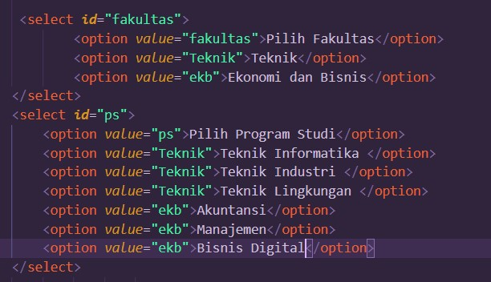

# Tugas pertemuan ke 3
Repository ini digunakan untuk memenuhi Tugas Lab2Web

Nama    : Dani Darmawan 
NIM     : 312010154 
KELAS   : TI.20.B1  
## Order List
 
 

## Unorder List
 
 

## Description List
 
 

## Membuat Tabel
 
 

## Menggabungkan Sel Data
 
 

## Membuat Form
 
 

## Menambahkan Style
 
 

## Menampilkan Dropdown dan Listbox
 
 

